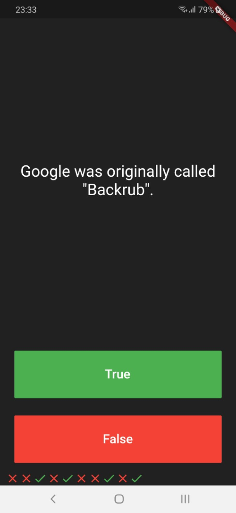

# I Am Rich

It's a simple quiz app with some prepared questions.

## Screenshots



## Preparing Dependencies

Use :

```bash
flutter pub get
```
To install all the dependencies in the pubspec.yaml file.

## Runing The App

```bash
flutter run
```
